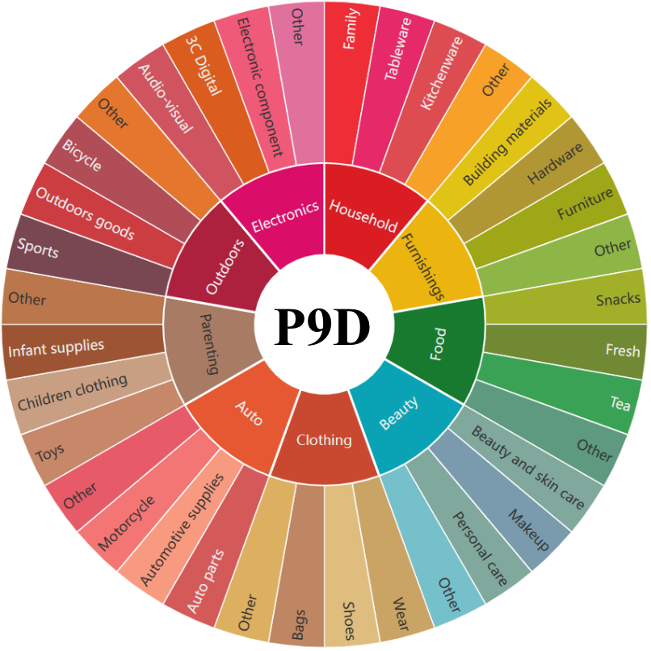
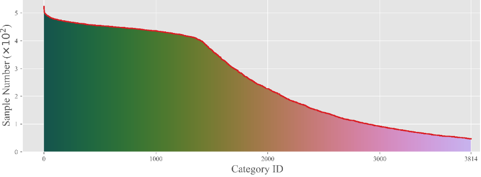
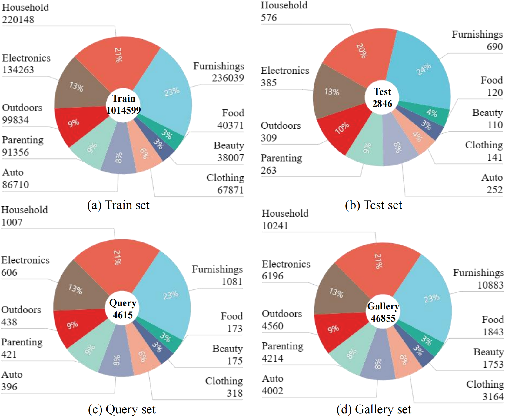

# P9D (Product 9 Domains) 

The Download methods of Vision-language Continual Pretraining Dataset **P9D**.

## Introduction
P9D (Product 9 Domains) is a multimodal dataset that support the study of Vision-Language Continual Pretraining (VLCP).
P9D includes more than 1 million image-text pairs of real products. According to the industry name of products, P9D is divided into 9 tasks to sequential training which are **Household, Furnishings, Food, Beauty, Clothing, Auto, Parenting, Outdoor, and Electronics.** These product domains contain the different and rich knowledge to support the VLCP. 

Different from the traditional Class-Incremental Learning (CIL) that divides different tasks according to the narrow category concept, we divide different tasks by product domains covering rich categories to simulate the change of knowledge domain in continual pretraining. 

<p align="center"></p>

The P9D contains over 3800 categories and the number of samples in different categories is consistent with the realistic long-tail distribution.

<p align="center"></p>

Besides, The P9D dataset has 1,014,599 image-text pairs for training, and 2,846 pairs as the test set of cross-modal retrieval. 4,615 pairs and 46,855 pairs as the query set and gallery set of multi-modal retrieval. 

<p align="center"></p>

##  :open_file_folder: Download Dataset
### Step :one:: Download JSON Files. 
These files contain the image-link ("image_link" or "oss_url") and captions of each product.

The download links of JSON files:

|     | Train / Test / Query / Gallery set |
|:-------- |:------------:| 
|Google Driver| [Here](https://drive.google.com/file/d/1nGpNS2GPLawMYiNNR8Z9AKlJWfYtmLJh/view?usp=drive_link) | 
|Baidu Netdisk| [Here](https://pan.baidu.com/s/19uLDfcWpEcp2ZG4GMN3Vxg?pwd=9fm8)| 


### Step :two: : Download Images. 

There are two methods to download all images of P9D: 

- Method 1： Online download each image
  
By simply changing the storage path, you can use codes of this codebase to download all images to specified path. 
```
P9D
├── download_images_train.py # download the images of train set
├── download_images_test.py # you can use it to download the images of test/query/gallery set
├── download_images_check.py # In the first download, some images may fail to download and this code can download missing images.

```


- Method 2： Unzip the zip files.

The zip file can be download from this [Baidu Netdisk](https://pan.baidu.com/s/1NXn_5TA53B2gqcHXR-ZFbQ?pwd=ezgk)


:pushpin: Tips: 
This process can be slow due to the large number of small files that need to be downloaded or unzipped. In addition, please ensure that there is at least 250G of remaining storage. You may need more if you unzip these zip files.


## :pencil: Citation
If this codebase is useful to you, please cite our work:
```
@article{zhu2023ctp,
  title={CTP: Towards Vision-Language Continual Pretraining via Compatible
Momentum Contrast and Topology Preservation},
  author={Hongguang Zhu and Yunchao Wei and Xiaodan Liang and Chunjie Zhang and Yao Zhao},
  journal={Proceedings of the IEEE International Conference on Computer Vision},
  year={2023},
}
```
## :panda_face: Contacts
If you have any question, please contact me :blush: : kevinlight831@gmail.com or hongguang@bjtu.edu.cn.